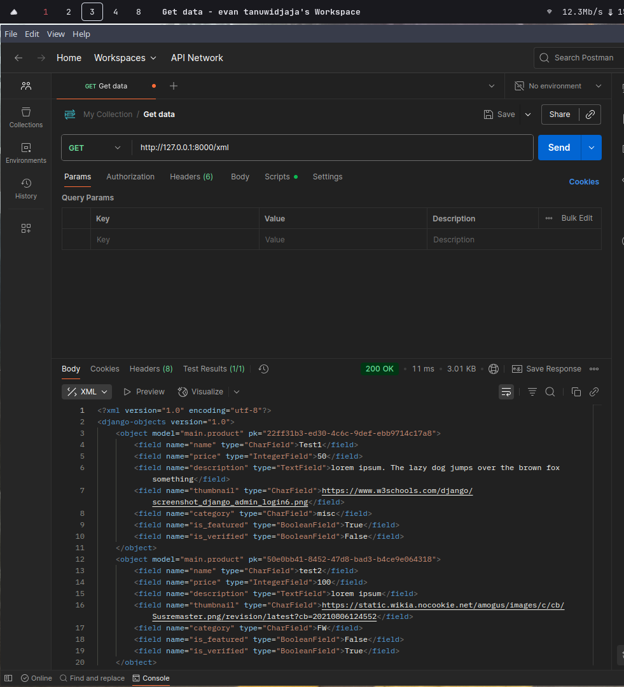
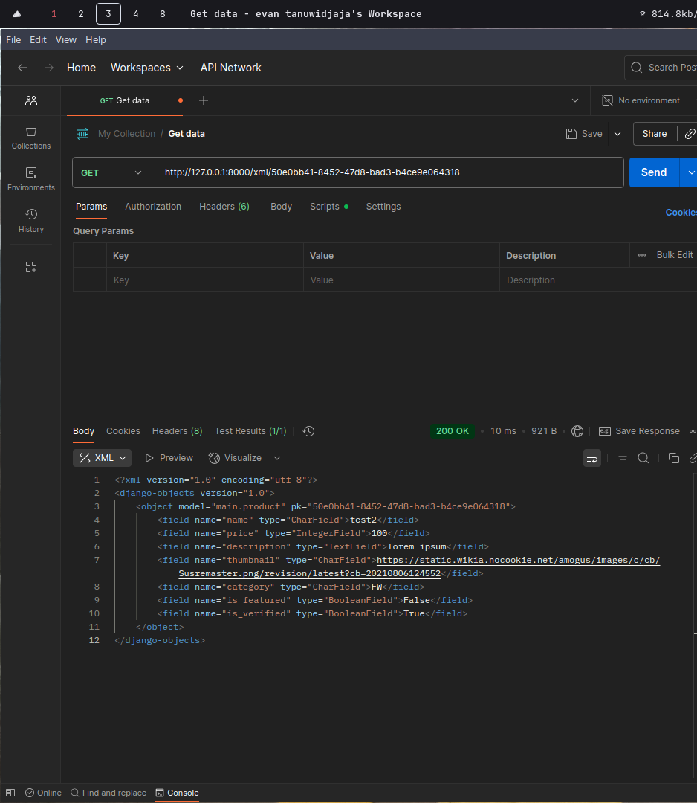
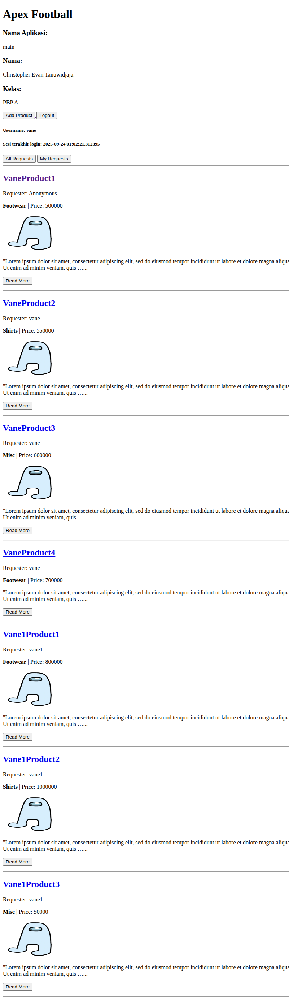

# apex-football
## Link deployment PWS
https://christopher-evan41-apexfootball.pbp.cs.ui.ac.id/

## Membuat projek django baru
Pertama gunakan perintah "cd" untuk memasuki directory git repositorynya. Lalu buatlah virtual env dengan perintah.

`python -m venv env`

Ini akan menghindari clashing antar dependencies dan membuat environment lebih rapi secara umum. Lalu, aktifkan venvnya agar berlaku pada sesi terminal sekarang.

`source ./env/bin/activate`

Sekarang kita ketik file baru requirements.txt sesuai pada tutorial 0 untuk menyesuaikan library yang perlu diinstalasi.

```
django
gunicorn
whitenoise
psycopg2-binary
requests
urllib3
python-dotenv
```

Kemudian kita install setiap baris requirements.txt dengan pip dengan perintah

`pip install -r requirements.txt`

Setelah environment python sudah siap, gunakan perintah startproject yang disediakan django-admin untuk membuat aplikasi baru. Kita perlu menambahkan argumen "." pada perintah untuk mengspesifikasi dimana meletakkan projek barunya ("." menyatakan current directory)

`django-admin startproject apex_football .`

Berikutnya tambahkan file .env dengan isi

`PRODUCTION=False`

File .env bertujuan untuk mengatur environment variables saat server dijalankan pada lokal, yakni hanya untuk testing dahulu.

Lalu buatlah file .env.prod dengan isi

```
DB_NAME=<nama database>
DB_HOST=<host database>
DB_PORT=<port database>
DB_USER=<username database>
DB_PASSWORD=<password database>
SCHEMA=tugas_individu
PRODUCTION=True
```

Saya tidak akan lampirkan informasi DB demi keamanan, namun dapat dilihat file ini bertujuan untuk mengatur environment variables saat server dijalankan pada hosting aslinya (dalam tugas ini, pada PWS). Dan juga berisi kredensial database dan skema yang digunakan, karena ini merupakan tugas individu, saya menggunakan skema tersebut.

Namun .env dan .env.prod hanyalah file yang berisi pengaturannya, untuk benar - benar memuat nilai tersebut pada sistem (host yang menjalankan servernya), kita perlu modifikasi settings.py untuk membaca dan mengatur environment variabelnya. Bagian ini diletakkan bagian atas (setelah import path) agar settings.py dapat membaca environment variables yang telah diubah

```
...
import os
from dotenv import load_dotenv
load_dotenv()
...
```

Lalu dalam settings.py carilah variabel array bernama ALLOWED_HOSTS, kita akan tambahkan host lokal dan host yang digunakan PWS nanti. Pastikan bagian link HTTPS tidak dicantumkan.

```
...
ALLOWED_HOSTS = ["localhost", "127.0.0.1", "christopher-evan41-apexfootball.pbp.cs.ui.ac.id"]
...
```

Lalu kita coba buat variabel baru (tepat diatas DEBUG). Yang akan mengambil environment variabel pada system untuk di assign ke variabel PRODUCTION di django.

`PRODUCTION = os.getenv('PRODUCTION', 'False').lower() == 'true'`

Function getenv menerima parameter nama envrionment variabel, dan juga default jika environment variabelnya tidak ditemukan. Kemudian dengan konsep yang sama, kita set informasi konfigurasi database yang digunakan.

```
if PRODUCTION:
    DATABASES = {
        'default': {
            'ENGINE': 'django.db.backends.postgresql',
            'NAME': os.getenv('DB_NAME'),
            'USER': os.getenv('DB_USER'),
            'PASSWORD': os.getenv('DB_PASSWORD'),
            'HOST': os.getenv('DB_HOST'),
            'PORT': os.getenv('DB_PORT'),
            'OPTIONS': {
                'options': f"-c search_path={os.getenv('SCHEMA', 'public')}"
            }
        }
    }
else:
    DATABASES = {
        'default': {
            'ENGINE': 'django.db.backends.sqlite3',
            'NAME': BASE_DIR / 'db.sqlite3',
        }
    }
```

Jika server dijalankan dalam production, akan memakai database yang disediakan PWS yaitu postgresql. Kita tambahkan spesifikasi ini pada key 'ENGINE' dalam dictionarynya. Lalu informasi lain terkait name, user, host, dan sebagainya akan kita cuplik dari file .env.prod yang kita buat sebelumnya. Pada kunci options, kita tambahkan argumen baru yang akan secara default mengatur search path database pada skema tugas_individu. Jika database dijalankan lokal, kita pakai sqlite3 saja yang kita namakan berdasarkan direktori projek kita. Setelah selesai, jangan lupa lakukan migrasi database agar perubahan pada database akan tertampil pada server.

`python manage.py migrate`

Kita dapat lihat perintah terkait projek kita dapat kita jalankan dalam manage.py. Untuk menjalankan server, kita jalankan perintah

`python manage.py runserver`

Lalu akhirnya kita bisa jalankan projek pada lokal yaitu port 8000 secara default. Kita hanya perlu datang ke link localhost:8000.

## Membuat aplikasi main
Pertama kita jalankan perintah tersebut dalam manage.py

`python manage.py startapp main`

Jangan lupa untuk mendaftarkan aplikasi main ini pada list "INSTALLED_APPS" dalam settings.py

```
...
INSTALLED_APPS = [
    'django.contrib.admin',
    'django.contrib.auth',
    'django.contrib.contenttypes',
    'django.contrib.sessions',
    'django.contrib.messages',
    'django.contrib.staticfiles',
    'main',
]
...
```
Langkah ini penting agar Django dapat mengenal aplikasi apa saja pada folder projeknya.

## Melakukan routing pada proyek agar dapat menjalankan aplikasi main
Pertama kita perlu routing URL dari level projek hingga ke main. Ini dilakukan dengan modifikasi file urls.py dalam direktori apex_football dalam projek saya. Kita import function include dari django yang berfungsi untuk mengimpor pola URL dari aplikasi main.

```
...
from django.urls import path, include
...
```

Berikutnya kita hanya perlu tambahkan URL path yang mengarah pada main, dalam kasus ini kita buat saja kosong (jadi default / rootnya).

```
urlpatterns = [
    ...
    path('', include('main.urls')),
    ...
]
```

Namun belum selesai, dari main kita harus melakukan routing untuk display view berdasarkan URL yang diminta. Maka kita perlu buat file urls.py pada aplikasi main dan menulis view apa saja dengan URL apa yang ditampil.

```
from django.urls import path
from main.views import show_index

urlpatterns = [
    path('', index, name='index'),
]
```

Kita belum buat view index, maka langkah berikutnya dilanjutkan.

## Membuat sebuah fungsi pada views.py untuk dikembalikan ke dalam sebuah template HTML yang menampilkan nama aplikasi serta nama dan kelas kamu.

Pada views.py dalam direktori main, kita akan tambahkan fungsi view bernama index yang menerima http request dan mengembalikannya sebagai html. Kita akan render requestnya dengan template index.html dimana kita input data nama, kelas, dan nama aplikasi dalam bentuk dictionary.

```
from django.shortcuts import render


def show_index(request):
    return render(
        request,
        "index.html",
        {
            "nama": "Christopher Evan Tanuwidjaja",
            "kelas": "A",
            "app_name": "main"
        }
    )
```

Sekarang kita perlu buat file html dalam folder templates dalam aplikasi main agar views.py dapat menampilkan response htmlnya.

```
<h1>Apex Football</h1>

<h3>Nama Aplikasi: </h3>
<p>{{ app_name }}</p> 
<h3>Nama: </h3>
<p>{{ nama }}</p> 
<h3>Kelas: </h3>
<p>PBP {{ kelas }}</p>
```

Akhirnya tertampil halaman HTML berdasarkan data tersebut. (ini terdapat dalam commit hash 8101f82c6ff42e96974601e927f9c088ae314f41)

## Membuat model pada aplikasi main dengan nama Product

Pertama kita modifikasi isi dari models.py dalam aplikasi main, kita tambahkan kelas baru "Product" yang inherit dari kelas Model yang diberikan django. Rencana toko football saya adalah memberikan pengguna kebebasan untuk memesan produk custom, tentunya diperlukan verifikasi secara manual. Sehingga saya tambahkan field "is_verified" untuk menandakan pesanan yang sudah diverifikasi kelayakannya. Dan juga saya tambahkan id sebagai primary key dalam database agar setiap order mudah diidentifikasinya secara unik.

```
class Product(models.Model):
    CATEGORIES = [
        ('FW', 'Footwear'),
        ('Sh', 'Shirts'),
        ('misc', 'Misc'),
    ]

    id = models.UUIDField(primary_key=True, default=uuid.uuid4, editable=False)
    name = models.CharField(max_length=255)
    price = models.IntegerField(default=0)
    description = models.TextField(max_length=1000)
    thumbnail = models.URLField(blank=True, null=True)
    category = models.URLField(max_length=20, choices=CATEGORIES, default='FW')
    is_featured = models.BooleanField(default=False)
    is_verified = models.BooleanField(default=False)

    def __str__(self):
        return self.name
```

Jangan lupa setelah membuat model, kita jalankan perintah berikut untuk memperbarui migrasi sekarang.

```
python manage.py makemigrations
python manage.py migrate
```

Dalam konteks ini, "makemigrations" adalah bagaikan "git add" yang bertugas menyeleksi file yang ingin di commit, dan "migrate" adalah bagaikan "git commit" yang bertugas melakukan perubahan. Dalam konteks DB, perubahan bermaksud pada penambahan atau pengurangan field dan juga penambahan, pengurangan, ataupun modifikasi model baru.

## Melakukan deployment ke PWS terhadap aplikasi yang sudah dibuat sehingga nantinya dapat diakses oleh teman-temanmu melalui Internet.

Setelah selesai, kita hanya perlu membuat projek baru pada PWS (Pacil Web Service). Lalu menggunggah projek ke remote pws dengan perintah berikut.

```
git remote add pws https://pbp.cs.ui.ac.id/christopher.evan41/apexfootball
```

Pertama kita perlu menambahkan remote pws yang disediakan ke git repository kita (Berbeda dengan remote "origin" yang disediakan github). Kita namakan remote ini "pws"

`git branch -M master`

Perintah ini membuat branch baru bernama master. Untuk disiapkan dipush.

`git push pws master`

Perintah ini akan push kode kita ke branch master yang baru dibuat ke repository pada PWS untuk dijalankan. Sebaiknya juga kita tambahkan environment variables production yang telah dibuat sebelumnya berdasarkan .env.prod. Hanya perlu kita tempelkan ke raw editor pada tab environment variables.

```
DB_HOST=...
DB_NAME=...
DB_PASSWORD=...
DB_PORT=...
DB_USER=...
DEBUG=False
PRODUCTION=True
SCHEMA=tugas_individu
```

## Bagan Django


Hubungan pertama dimulai saat pengguna request konek pada web app kita. request ini akan melalui internet yakni pertama melewati modem. Setelah request tiba pada server, pertama akan dirouting melewati urls.py yang berada pada project level, lalu di arahkan lagi pada aplikasi. Setelah tiba di urls.py dalam aplikasi, akan diterima oleh berbagai view tergantung urlnya. View dapat berupa fungsi maupun class, namun fungsinya tetep sama yaitu menerima request HTML, lalu mengembalikan response (yang berupa HTML) berdasarkan request tersebut. views.py juga berinteraksi dengan models.py yang merupakan abstraksi atas operasi DB yang lebih rendah (seperti postgresql, sqlite3, dll). Interaksi model dan database saling request dan response, untuk update atau query DB pada server. Setelah views selesai menjalankan programnya, akan menghasilkan hasil response html yang umumnya merupakan template HTML dimana hanya beberapa nilai yang sebenarnya berubah. Akhirnya response HTML ini akan dikembalikan pada user melalui internet, lalu siklusnya berulang lagi.

## Peran settings.py
Secara umum settings.py berfungsi untuk menyimpan konfigurasi projek yang global, berikut beberapa penjelasan variabel pada settings.py.

- BASE_DIR : Path ke direktori akar dari projek
- DEBUG : Jika true, umumnya menampilkan log error yang berguna untuk development. Namun untuk Production sebaiknya dinonaktifkan karena dapat membuat celah keamanan.
- ALLOWED_HOSTS : Daftar alamat host yang melayani projek django tersebut. Saat debug adalah true dan ini kosong, django akan otomatis mengisi alamat lokal host.
- INSTALLED_APPS : Daftar aplikasi yang aktif dalam django project. Juga berisi aplikasi builtin django seperti admin.
- DATABASES : konfigurasi database suatu projek. Menggunakan sqlite3 secara default.
- STATIC_ROOT : Path ke direktori yang berisi file - file yang bersifat global atau ingin digunakan untuk seluruh projek, seperti gambar, CSS stylesheets, dll.
- STATIC_URL : URL yang digunakan untuk mengakses file dalam STATIC_ROOT, berfungsi agar organisasi static file lebih mudah.


## Cara kerja migrasi DB pada django
Migrasi database di Django adalah cara Django untuk mempropagasikan perubahan yang dibuat pada model (di models.py) ke dalam skema database. Perintah "makemigrations" akan membuat folder migrations pada BASE_DIR yang berisi perubahan model yang ingin dilakukan pada DB. Folder migrations ini bagaikan folder .git dalam git, yang berfungsi sebagai version control DB secara tidak langsung. Setelah sudah siap, kita jalankan perintah "migrate" yang akan menerapkan perubahan yang kita buat ke DB. Mekanisme ini membuat DB lebih reliable, karena jika kita membuat perubahan tidak sengaja pada models.py, kita dapat lebih mudah mengembalikan perubahan tersebut. 


## Mengapa framework Django dijadikan permulaan pembelajaran pengembangan perangkat lunak?
Menurut saya, salah satu faktor yang kuat adalah penerapannya yang mirip dengan python yakni "batteries included". Hal ini berarti sudah banyak library untuk mengembangkan fungsi yang umum dilakukan, hingga mempercepat web development. Bagi pengguna, library ini memberikan kesempatan untuk mengerti web development secara konsep level tinggi lebih mudah ketimbang mempelajari setiap aspek dari web development terlebih dahulu (seperti DB, front end development, etc)

## Feedback Tutorial 1
Belum ada feedback, sejauh ini masih lancar mengikuti tutorial :)

## Menambahkan fungsi show_json, show_xml, show_json_by_id, show_xml_by_id
Untuk fungsi show_json dan show_xml, kita pertama perlu mengambil product_list
```
product_list = Product.objects.all()
```
Lalu kita perlu konversi objek model django jadi json atau xml, kita dapat gunakan library bawaan __serialisers__ dari django.
`serializers.serialize(<"xml" atau "json" tergantung fungsi>, product_list)`
selanjutnya, untuk menampilkan secara rapih, kita bisa gunakan contenttype default bawaan django untuk display xml atau jsonnya
`return HttpResponse(xml_data, content_type="application/<xml atau json>")`
Untuk mengambil objek berdasarkan id, kita dapat gunakan fungsi get() dalam Product untuk mengambil okurensi id yang matching pertama. Karena saya sudah setting id sebagai primary key, sudah dijamin tiap produk memiliki id yang unik (sehingga tidak perlu pakai query yang kompleks). Django juga menyediakan shortcut untuk return error 404 jika halaman tidak ditemukan dengan fungsi get_object_or_404(). Note bahwa fungsi serialise selalu membutuhkan input list, maka kita bungkus saja produk tersebut dalam 1 list.
```
def show_product_xml_by_id(request, id):
    product_item = get_object_or_404(Product, id=id)
    xml_data = serializers.serialize("xml", [product_item])
    return HttpResponse(xml_data, content_type="application/xml")

def show_product_json_by_id(request, id):
    product_item = get_object_or_404(Product, id=id)
    json_data = serializers.serialize("json", [product_item])
    return HttpResponse(json_data, content_type="application/json")
```

## Membuat routing URL untuk masing - masing views fungsi sebelumnya
Kita hanya perlu menambahkan url pada main/urls.py
```
...
path('xml', show_products_by_xml, name='show_products_by_xml'),
path('json', show_products_by_json, name='show_products_by_json'),
path('xml/<str:id>/', show_product_xml_by_id, name='show_product_xml_by_id'),
path('json/<str:id>/', show_product_json_by_id, name='show_product_json_by_id')
...
```
Kita hanya perlu menambahkan `<str:id>` untuk memerintah django untuk capture data id sebagai string, sehingga kita dapat gunakan dalam fungsi sebelumnya sebagai argumen id.  Tercantum dalam [dokumentasinya](https://docs.djangoproject.com/en/5.2/topics/http/urls/)

## Membuat halaman untuk menampilkan form DAN halaman untuk detail tiap produk
Pertama saya buat boilerplate base.html dan mendefinisikan block meta (yaitu pada head) dan block content (dalam body). Boilerplate ini akan digunakan untuk setiap halaman berikutnya. Pertama saya modif halaman utama saya dengan inherit dari base.html, lalu tambahkan elemen html baru yaitu tombol yang dibungkus anchor (elemen yang benar melakukan redirect link). Kita gunakan django template language untuk mengambil view bernama "create_product" pada main.
```
<a href = >
    <button>Add Product</button>
</a>
```
Lalu view show_index.html dimodifikasi agar mengirimkan konteks berupa produk yang ada.
```
def show_index(request):
    product_list = Product.objects.all()
    return render(
        request,
        "index.html",
        {
            "nama": "Christopher Evan Tanuwidjaja",
            "kelas": "A",
            "app_name": "main",
            "product_list": product_list
        }
    )
```
Setelah itu, tambahkan bagian baru dalam index.html yang menggunakan django template language untuk iterasi konteks produk dalam product_list dan menampilkan informasi yang sesuai.
```

<p>Belum ada data produk pada Apex Football</p>



<div>
    <h2><a href="">{{ product.name }}</a></h2>
    <b>{{ product.get_category_display }}</b> | 
    <b>Featured</b> | 
    <b>Verified</b> | Price: {{ product.price }}</p>

    
    
    <br />
    

    <p>{{ product.description|truncatewords:25 }}...</p>

    <p><a href=""><button>Read More</button></a></p>
</div>

<hr>



```
Template tersebut akan mengiterasi produk, lalu menampilkan link yang redirect user ke view "show_product/<id>" yang akan menampilkan setiap produk secara rapih, informasi singkat juga ditampilkan dalam index seperti Featured, Verified, category, harga, dan thumbnail. Namun teks deskripsi yang panjang akan di potong menjadi maximal 25 kata. Lalu dibuat view "show_product" untuk menampilkan halaman secara detail dan rapih dengan HTML
```
def show_product(request, id):
    product = get_object_or_404(Product, id=id)
    return render(
        request,
        "product_detail.html",
        {
            "product": product
        }
    )
```
Isi dari product_detail.html mirip dengan detail pada loop sebelumnya, hanya saja deskripsi tidak dipotong. Tampilan gambar juga lebih besar, dan ditambahkan tombol untuk kembali ke index.
```


<p>
    <a href="">
        <button>← Back to Product List</button>
    </a>
</p>

<h1>{{ product.name }}</h1>
<p>
    <b>{{ product.get_category_display }}</b> | 
    <b>Featured</b> | 
    <b>Verified</b> | Price: {{ product.price }}</p>



<br /><br />


<p>{{ product.description }}</p>


```


## Membuat halaman form untuk membuat produk

Pertama buat ProductForm yang menurunkan template ModelForm default yang disediakan django dalam forms.py.
```
from django.forms import ModelForm
from main.models import Product


class ProductForm(ModelForm):
    class Meta:
        model = Product
        fields = ["name", "price", "description", "category", "thumbnail"]
```
Lakukan overriding pada class Meta dalam ModelForm, lalu masukkan model dan field yang ingin diisi dalam form. Lalu tambahkan view "create_product" halaman tersebut dalam views.py.

```
def create_product(request):
    form = ProductForm(request.POST or None)
    if form.is_valid() and request.method == "POST":
        form.save()
        return redirect('main:show_index')

    context = {'form': form}
    return render(request, "create_product.html", context)
```
Views ini akan mengambil class ProductForm yang kita buat dengan menurunkan dari form default dari django. Class ini pertama akan menerima HTTP POST yang dikirim dari pengguna, (kita akses dengan request.POST). Namun sebelum kita save data dari form ke model kita, kita pertama cek apakah data dalam form valid. Lalu kita cek apakah pengguna benar telah submit data untuk POST (dengan cek apakah request.method == "POST"), pengecekan ini terjadi karena pertama kali user request halaman form, mereka belum submit, hanya request halaman pengisian. Jika kondisi memadai, kita jalankan `form.save()` lalu gunakan shortcut dari django untuk redirect ke halaman index. Jika kondisi tidak valid, kita hanya perlu render suatu html dengan konteks form tersebut. Sekarang Kita perlu buat HTML yang ditampilkan form tersebut.
```
 

<h1>Add Product</h1>

<form method="POST">
  
  <table>
    {{ form.as_table }}
    <tr>
      <td></td>
      <td>
        <input type="submit" value="Add PRODUCT" />
      </td>
    </tr>
  </table>
</form>


```
Dalam elemen form, kita gunakan method "POST" untuk menandakan request HTTP tersebut sedang request suatu perubahan database. Lalu kita insert template form pada django dengan `{{ form.as_table }}`. Dan akhirnya membuat input submit untuk add product.


## Mengapa data delivery penting?
Dalam kasus web platform, kita memerlukan data delivery karena model MVT secara implisit menunjukkan pengguna akan menerima data dalam bentuk HttpResponse dari server. Data delivery secara tidak langsung dibedakan jadi request dan response. Dengan data delivery, kita dapat membuat aplikasi yang bersifat lebih persisten dengan menyimpan data pada database server.

## JSON vs XML
Menurut saya seringkali JSON lebih banyak digunakan karena lebih umumnya lebih compact dan lebih mudah penggunaannya. Walaupun sebenarnya XML memiliki lebih banyak fitur, terkait namespaces dan schema. Schema dapat memberikan kebebasan untuk mendefinisikan struktur, data types, dan bahkan validasi. Sedangkan namespaces memberikan kita kesempatan untuk mengorganisasi data lebih baik. Salah satu penggunaan XML adalah implementasinya dalam file SVG untuk mendefinisikan grafik vektor, hal ini cocok karena membuat grafik vektor didefinisikan sebagai XML lebih mudah daripada membuat custom data struktur sendiri, sedangkan memang benar grafik vektor memerlukan organisasi dan standarisasi yang kuat agar perangkat lunak grafik vektor lainnya dapat parsing dengan mudah. Namun fitur tersebut memiliki dampak dimana file XML umumnya lebih mahal untuk diparsing dan dikirim, ketimbang JSON. Salah satu penyebabnya adalah JSON hanya menggunakan struktur key value pair, sedangkan XML menggunakan struktur tree yang lebih mahal untuk dijelajahi. Karena dalam web, kita umumnya hanya memerlukan pengiriman data yang cepat, efisien, dan murah dijelajahinya. Maka JSON jadi lebih banyak digunakan developer. 

## Fungsi is_valid() pada form
Fungsi ini penting dengan tujuan utamanya adalah keamanan dan standarisasi. Salah satu prinsip penting dalam web development adalah menganggap semua input dari pengguna jahat, karena input bisa menjadi celah keamanan yang mudah diexploitasi. Salah satunya adalah SQL injection, dimana pengguna dapat escape dari string input untuk mengeksekusi perintah SQL apapun pada database. Walaupun pada django, asal kita pakai Interface Models yang disediakan, django sudah persiapkan terhadap validasi input tersebut. Namun dalam kasus ini, tujuannya lebih pada standarisasi, yakni agar memastikan jika Field pada form diminta Integer, pengguna benar - benar mengirimkan field datatype berupa integer. Dengan melakukan validasi input, kita dapat pastikan program aman dan lebih rentan pada error. 

## Mengapa butuh CSRF token dan apa yang terjadi jika tidak digunakan
CSRF adalah singkat dari "cross-site request forgery" yakni mereferensi suatu tipe serangan siber, dimana penyerang mengirimkan suatu link kepada pengguna. Dimana jika mereka mengklik link tersebut, mereka akan otomatis melakukan request tersebut pada server. Token tersebut akan digenerate secara random dari django, dimana setiap kali pengguna melakukan request, server akan mengvalidasi berdasarkan token diberi, untuk mengkonfirmasi bahwa pengguna tersebut benar - benar mengirimkan requestnya. Jika token ini tidak ada, dan pengguna membuka link yang tidak aman, pengguna tersebut akan otomatis melakukan request atas nama mereka, walaupun mereka tidak mengetahui atau konfirmasi request tersebut. Request ini bisa berbahaya, seperti request untuk mengganti email menjadi milik penyerang, atau pengiriman uang ke akun penyerang. Untuk melakukan penyerangan ini, penyerang hanya perlu menyalin link untuk request apa yang mereka minta, lalu disembunyikan dalam bentuk hyperlink atau link shortener dalam email atau SMS.

## Belum ada feedback untuk Tutorial 2 :)

## Screenshot hasil Postman





## Apa itu Django AuthenticationForm, kelebihan dan kekurangan?
AuthenticationForm dalam Django adalah class yang menurunkan base class Form dengan tujuan sebagai interface yang memudahkan interaksi dan validasi data untuk ditulis ke database ataupun hanya dibaca. AuthenticationForm adalah builtin Form dengan fungsi khusus yakni menerima informasi login dan memeriksa apakah data login tersebut valid (dengan fungsi is_valid()). Class ini jika diinstansiasi pertama perlu data request.POST yang dkirimkan pengguna. 

Kelebihannya adalah lebih mudah digunakan karena Django sudah mengurus banyak hal terkait validasi input serta juga menyimpan template HTML sebagai table sebagai input formnya.

Kekurangannya adalah penggunaan class builtin tersebut cenderung kurang fleksibel, jika diinginkan fitur lain (seperti sistem ban, mungkin fitur remember me, ataupun SSO, etc), maka harus diimplementasikan sendiri dengan membuat form dari awal, atau menurunkan class tersebut. Penggunaan class juga menambahkan sedikit overhead (walaupun sebenarnya tidak besar perbedaan kecepatannya)

[Referensi](https://docs.djangoproject.com/en/5.2/topics/auth/default/)

## Apa perbedaan antara autentikasi dan otorisasi? Bagaiamana Django mengimplementasikan kedua konsep tersebut?
autentikasi merujuk pada proses verifikasi identitas pengguna. Sedangkan otorisasi adalah proses verifikasi apakah suatu identitas pengguna memiliki hak akses pada suatu hal. 

Django mengimplementasikan autentikasi dengan cara menyediakan berbagai interface (seperti form, dan builtin model untuk user). Sekaligus memberikan builtin dari interface tersebut. Dalam backend Django, hal terkait password user juga tidak disimpan plaintext, namun dengan hashing, sehingga kebocoran database tidak begitu buruk. Merujuk poin sebelumnya, fitur - fitur yang diberikan AuthenticationForm memudahkan implementasi autentikasi bahkan dengan builtin views dan template HTMLnya. Implementasi CSRF token dan cookies yang disediakan Django juga membantu membuat autentikasi yang lebih mudah dan aman.

Django mengimplementasikan otorisasi dengan membuat sistem permission pada user model builtinnya. Sistem user dalam Django mirip dengan linux, dimana permission setiap user dalam dipasang dengan grup, dimana grup tersebut akan memberikan permission yang sesuai pada user tersebut. Permission ini digunakan Django untuk menentukan apakah suatu User memiliki hak melihat objek, menambah objek, menghapus objek, bahkan hingga pengaksesan Form. Jika diperlukan, Django juga mengimplementasikan interface untuk membuat custom permission (Permission juga disimpan sebagai Model dalam Django).

[Referensi](https://docs.djangoproject.com/en/5.2/topics/auth/default/#topic-authorization)

##  Apa saja kelebihan dan kekurangan session dan cookies dalam konteks menyimpan state di aplikasi web?

Kelebihan utama dari cookies adalah menghemat waktu pengguna dengan membuat server tetap menganggap pengguna sudah login dalam suatu kurun waktu. Karena sistem MVT dimana setiap request independent dari satu sama lain, tanpa session dan cookies, pengguna akan harus melakukan login setiap kali ingin melakukan perubahan apapun pada database.

Namun penggunaan cookies tersebut dapat membuka celah terhadap serangan siber, dimana jika suatu penyerang dapat akses terhadap cookies tersebut, maka mereka dapat melakukan aksi bagaikan mereka memiliki akun kamu. Salah satu serangan yang dapat dilakukan adalah CSRF (Cross Site Request Forgery), dimana penyerang menyembunyikan link request yang jika dijalankan pengguna, dapat tidak sengaja menggunakan session mereka untuk melakukan tindakan yang bahaya (seperti reset password atau merubah email). Cookies juga dapat menjadi privacy concern karena beberapa website dapat menyimpan data pengguna tanpa izin, dan cookies dalam suatu situs dapat dilacak dengan situs lain.

##  Apakah penggunaan cookies aman secara default dalam pengembangan web, atau apakah ada risiko potensial yang harus diwaspadai? Bagaimana Django menangani hal tersebut?

Merujuk pada poin sebelumnya, dimana salah satu risiko adalah CSRF, dimana Django menangani risiko tersebut dengan menyimpan CSRF token (yang digunakan untuk request), sehingga penyerang juga membutuhkan token tersebut untuk memaksa pengguna melakukan suatu request. Salah satu risiko keamanan lainnya adalah XSS (cross site scripting), dimana penyerang dapat menjalankan program javascript melalui celah input dalam program (salah satu celah yang penyerang dapat lakukan adalah mencuri session cookie suatu pengguna dengan menjalankan skrip pada server ataupun bisa mengganti session key pada server tersendiri).  

## Mengimplementasikan fungsi registrasi, login, dan logout untuk memungkinkan pengguna mengakses aplikasi sebelumnya sesuai dengan status login/logoutnya

Pertama dibuat views baru berupa login_user, register_user, dan logout.

```
def register_user(request):
    form = UserCreationForm(request.POST or None)
    if request.method == "POST" and form.is_valid():
        if form.is_valid():
            form.save()
            messages.success(request, 'Your account has been successfully created!')
            return redirect('main:login')
    context = {'form': form}
    return render(request, 'register.html', context)
```
Fungsi register menggunakan builtin form Django khusus untuk registrasi (UserCreationForm). Untuk validasi input dan penampilan html pada template. Setelah berhasil, akan dilakukan redirect ke halaman login. Akan dikirimkan juga data messages yang mengindikasikan akun berhasil dibuat, (data messages dapat ditampilkan dalam html dengan langsung mereferensi "messages"). Jika request bukan POST, maka form akan dikirimkan ke pengguna sebagai context untuk digunakan builtin "as_table" htmlnya.
```



<title>Register</title>




<div>
  <h1>Register</h1>

  <form method="POST">
    
    <table>
      {{ form.as_table }}
      <tr>
        <td></td>
        <td><input type="submit" name="submit" value="Daftar" /></td>
      </tr>
    </table>
  </form>

  
  <ul>
    
    <li>{{ message }}</li>
    
  </ul>
  
</div>


```
Kode di atas adalah isi dari register.html. Untuk memberikan user cara request data (yakni data akun), diperlukan elemen html form dengan method POST (method ini umumnya digunakan jika pengguna ingin mengirimkan data ke server). Lalu berdasarkan yang dirujuk sebelumnya, diperlukan penjagaan form ini dengan csrf_token agar terjaga dari serangan CSRF. Berikutnya akan digunakan template html yang disediakan form tersebut dengan mengambil atribut "as_table" yang berisi template html khusus untuk registrasi (lengkap dengan validasi input lagi dari sisi client side). Field ini disisipi dalam elemen table, berikutnya akan ditambahkan baris baru yang berisi elemen input dengan tipe [submit](https://developer.mozilla.org/en-US/docs/Web/HTML/Reference/Elements/input/submit) (tipe ini secara default berguna untuk melakukan submisi data ke server). Atribut "name" hanya digunakan jika diperlukan lebih dari satu tombol input, lalu atribut Daftar jelas adalah isi text dari tombol tersebut.  Lalu untuk bagian bawah akan secara sederhana cek messages dan display pesan tersebut dalam konteks ini akan menampilkan apakah akun berhasil registrasi atau belum. 

```
def login_user(request):
    if request.method == 'POST':
        form = AuthenticationForm(data=request.POST)
        if form.is_valid():
            user = form.get_user()
            login(request, user)
            response = HttpResponseRedirect(reverse("main:show_index"))
            response.set_cookie('last_login', str(datetime.datetime.now()))
            return response
    else:
        form = AuthenticationForm(request)
    context = {'form': form}
    return render(request, 'login.html', context)
```
Berikutnya view login user, dimana form yang digunakan sekarang adalah AuthenticationForm khusus login (request untuk autentikasi juga merupakan POST, karena pengguna mengirimkan data login yang mereka ingin diautentikasi). Dari request tersebut (pertama dicek apakah data autentikasi valid dan sesuai database dengan is_valid()), Django dapat memberikan class pengguna builtin nya "user" dari request tersebut, lalu agar session tersebut dapat ditabung, akan dilakukan fungsi builtin login dari Django yang menerima request dan pengguna. Kemudian setelah selesai jalan fungsi login(), akan response akan dipasang sebagai redirection kembali ke halamam show_index (fungsi reverse hanya bertujuan merubah nama dari path sebelumnya menjadi url aslinya), agar dapat menampilkan kapan terakhir kali pengguna login akan disimpan session tersebut sebagai cookie (menggunakan library builtin python datetime untuk mengambil waktu sekarang login). Setelah itu akan dilakukan dikembalikan response tersebut.

Jika request bukan merupakan POST, maka pengguna sedang ingin minta html untuk autentikasi, sama seperti form registrasi, form akan dikirim sebagai context untuk diambil builtin html "as_table" nya.

```



<title>Login</title>



<div class="login">
  <h1>Login</h1>

  <form method="POST" action="">
    
    <table>
      {{ form.as_table }}
      <tr>
        <td></td>
        <td><input class="btn login_btn" type="submit" value="Login" /></td>
      </tr>
    </table>
  </form>

  
  <ul>
    
    <li>{{ message }}</li>
    
  </ul>
   Don't have an account yet?
  <a href="">Register Now</a>
</div>


```

Di atas adalah kode login.html mirip dengan register.html. Dengan tambahan class btn dan login_btn agar dapat diperindahkan dengan stylesheet .css default Django. Juga berisi tautan register bagi pengguna yang belum register.


```
def logout_user(request):
    logout(request)
    return redirect('main:login')
```

Berikutnya fungsi view logout, yang akan menggunakan builtin fungsi Django logout() dengan tujuan mirip dengan fungsi login() sebelumnya, hanya dalam konteks ini, Django akan menutup session usernya. Lalu akan diredirect kembali ke halaman login.

```
...
<a href="">
  <button>Logout</button>
</a>
...
```
Pastikan tambahkan juga tombol tersebut pada halaman indeks agar pengguna bisa logout secara intuitif.

```
...
path('login/', login_user, name="login"),
path('register/', register_user, name="register"),
path('logout/', logout_user, name="logout"),
```
Jangan lupa untuk menambahkan URL tersebut agar halaman dapat diakses.


## Menghubungkan model Product dengan User.
Tambahkan field baru bertipe ForeignKey pada model Product
```
...
requester = models.ForeignKey(User, on_delete=models.CASCADE, null=True)
...
```
Field ini akan dinamakan requester sesuai tema program (dimana pengguna hanya akan request pembuatan produk tersebut). ForeignKey berarti bahwa field ini merujuk pada suatu field di tabel model lain (dalam kasus ini merujuk pada model User). Sehingga mengimplementasikan hubungan many to one antara Produk dan User. Keyword argumen "on_delete" mendefinisikan apa yang dilakukan Django pada database jika suatu model User dihapus, dalam kasus ini kita juga menginginkan kunci pada model Product juga dihapus (karena memang sudah tidak valid primary key Usernya). Jangan lupa untuk melakukan migrasi untuk perubahan model.

Kemudian perlu dimodifikasi view pembuatan Product agar juga menyimpan pengguna siapa yang membuatnya.
```
def create_product(request):
    form = ProductForm(request.POST or None)
    if form.is_valid() and request.method == "POST":
        product_entry = form.save(commit=False)
        product_entry.requester = request.user
        product_entry.save()
        return redirect('main:show_index')

    context = {'form': form}
    return render(request, "create_product.html", context)
```
Karena ada field yang harus didefinisikan manual oleh server (yakni field User), maka form harus disave dengan commit=False dahulu (ini akan mnabung struktur model tanpa ditulis ke database terlebih dahulu), kemudian akan dipasang field requester berdasarkan akun siapa yang sedang melakukan request tersebut, setelah ini baru dapat dipanggil fungsi save() untuk menulisnya. Setelah itu, harus ditampilkan pada index.html dan product_detail.html agar dapat dilihat siapakah yang membuat request produk tersebut.
```

    <p>Requester: {{ product.requester.username }}</p>

    <p>Requester: Anonymous</p>

```

Cuplikan tersebut hanya perlu saya sisipkan dalam index.html dan product_detail.html, (jika kosong di masukkan placeholder anon). Agar memudahkan pengguna melihat request yang telah dibuatnya, pada index halaman akan ditambahkan query all requests dan my requests.
```
def show_index(request):
    filter_type = request.GET.get("filter", "all")
    if filter_type == "all":
        product_list = Product.objects.all()
    else:
        product_list = Product.objects.filter(requester=request.user)
    return render(
        request,
        "index.html",
        {
            "nama": "Christopher Evan Tanuwidjaja",
            "kelas": "A",
            "app_name": "main",
            "product_list": product_list,
            "last_login": request.COOKIES.get('last_login', 'Never')
        }
    )
```
Pertama akan ditambahkan fitur pada views show_index() dimana jika diberi flag "filter", maka product_list yang ditampilkan menyesuaikan permintaan. Untuk mendapatkan pengguna yang sesuai, digunakan saja method filter pada model yang disediakan Django. 

##  Menampilkan detail informasi pengguna yang sedang logged in seperti username dan menerapkan cookies seperti last_login pada halaman utama aplikasi.
Penerapan cookies dan session sudah dijelaskan pada poin sebelumnya, untuk menampilkan username dan last_login hanya diperlukan query data tersebut dari model User yang diberikan dengan context (khusus model username, Django sudah secara default memiliki context tersebut). 
```
...
<h5>Username: {{ user.username }}</h5>
<h5>Sesi terakhir login: {{ last_login }}</h5>
...
```
Beberapa fungsi akan menggunakan decorator builtin Django agar beberapa views memerlukan autentikasi jika ingin diakses. Maka akan ditambahkan decorator tersebut pada beberapa views yang penting.
```
@login_required(login_url='/login')
    def show_product(request, id):
        ...

@login_required(login_url='/login')
    def create_product(request):
        ...

@login_required(login_url='/login')
    def show_index(request):
        ...
```

## Membuat dua (2) akun pengguna dengan masing-masing tiga (3) dummy data menggunakan model yang telah dibuat sebelumnya untuk setiap akun di lokal.

Hal ini secara mudah dilakukan dengan menggunakan hubungan model Product dengan User sebelumnya untuk membuat masing - masing model.




